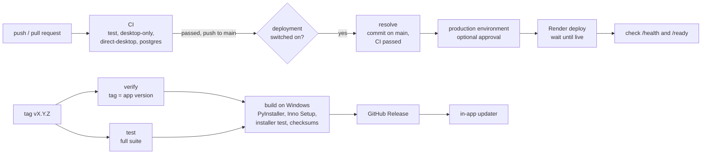

# CI/CD pipeline

How a change travels from a commit to the people using Schedule Maxing. Everything runs on GitHub
Actions from three workflow files in `.github/workflows/`:

| Workflow | File | Starts on | Result |
|---|---|---|---|
| **CI** | `ci.yml` | every push and every pull request | the commit is tested, compiled and linted |
| **Release** (desktop delivery) | `release.yml` | a pushed tag `vX.Y.Z`, or by hand (dry run) | a GitHub Release with the Windows installer, which installed copies update to |
| **Deploy backend** (server deployment) | `deploy-backend.yml` | CI passing for a push to `main`, or by hand | the backend on Render runs that commit |

The project ships two different things, so it has two delivery paths:

- the **desktop app** is delivered as a versioned Windows installer; a release is a deliberate act (a tag);
- the **backend** (`backend/`, optional — the desktop works without it) is deployed continuously from `main`.



## 1. Continuous integration (`ci.yml`)

Runs on every push to any branch and on every pull request. Four independent jobs, all on
`ubuntu-latest` with Python 3.10; a commit is green only when all four pass.

| Job | Installs | What it proves |
|---|---|---|
| `test` | `requirements.txt` (everything) | the complete suite (`xvfb-run -a python -m pytest`, real windows on a virtual display), `python -m compileall .`, `python -m ruff check .` |
| `desktop-only` | `requirements-desktop.txt` + pytest | the desktop app needs no web/server package: it first fails if FastAPI, Starlette, Uvicorn, SQLAlchemy, Alembic, psycopg, PyJWT, argon2 or HTTPX is importable, then runs every suite except `tests/backend`, `tests/sync`, `tests/web`, `tests/direct` ([desktop-web-boundaries.md](desktop-web-boundaries.md)) |
| `direct-desktop` | `requirements-direct.txt` + pytest | the optional direct PostgreSQL mode works with no HTTP/JWT package, against a PostgreSQL 17 service container ([direct-postgres.md](direct-postgres.md)) |
| `postgres` | `requirements.txt` | the `postgres`-marked tests, then `tests/backend`, `tests/sync` and `tests/direct` again on a real PostgreSQL 17 instead of SQLite ([backend.md](backend.md#tests)) |

The PostgreSQL service containers are throwaway and use trust authentication on the runner's
private network, so CI needs **no secret at all**.

The same checks locally ([testing.md](testing.md)):

```bash
python -m pytest -m dev        # the fast development suite, while working
python -m pytest               # the complete suite, as the `test` job runs it
python -m compileall .
ruff check .
```

A commit message containing `[skip ci]` skips CI for that push (a GitHub feature). Such a push is
then never deployed either, because deployment starts only from a CI run that passed.

## 2. Desktop delivery (`release.yml`)

A release is published by pushing a tag that equals the application version:

```powershell
# 1. set the new version in app/version.py, commit, merge to main
git tag v1.2.3
git push origin v1.2.3
```

| Job | Runs on | What it does |
|---|---|---|
| `verify` | Ubuntu | the tag must be exactly `v` + the version in `app/version.py`, and no release for it may exist yet |
| `test` | Ubuntu | the complete suite, compileall and ruff — the same commands as CI's `test` job |
| `build` | Windows | needs `verify` and `test`. Packaging and start-up tests on Windows, PyInstaller build with bundle checks and a packaged self-test (`packaging\windows\build_windows.ps1`), the Inno Setup installer, an install / restart / upgrade / uninstall test of that installer, checksum verification, then the installer and `SHA256SUMS.txt` are uploaded as a workflow artifact |
| `publish` | Ubuntu | needs `build`; tag pushes only. Creates a stable GitHub Release (not a draft, not a pre-release, marked latest) with exactly the installer and `SHA256SUMS.txt` |

Any failing job stops everything after it, so nothing is published unless all of it passed.

- **Delivery to users.** Installed copies ask GitHub for the latest stable release, verify the
  download against `SHA256SUMS.txt`, and install it when the user chooses "Update now". Publishing
  the release is therefore the delivery step.
- **Dry run.** Actions > Release > Run workflow builds and tests everything the same way and
  leaves the installer as a workflow artifact, but never publishes.
- **Code signing** is optional: with the repository secrets `SM_SIGN_PFX_BASE64` and
  `SM_SIGN_PFX_PASSWORD` the executable and installer are signed; without them the build is
  unsigned and says so.
- **Withdrawing a release.** Mark it pre-release (or delete it) and publish a higher version;
  there is no automatic downgrade.

Details of the build, the installer, signing, the updater and its trust model are in
[windows-distribution.md](windows-distribution.md).

## 3. Backend deployment (`deploy-backend.yml`)

Deploys the HTTP API to the Render web service described in
[render-deployment.md](render-deployment.md). It is **off until switched on** (see
[One-time setup](#one-time-setup)): without the repository variable `BACKEND_DEPLOY_ENABLED=true`
both jobs are skipped and nothing contacts Render.

### What happens

1. **Trigger.** CI finishes for a push to `main` of this repository and passed. (A failed or
   cancelled CI run, a pull request, or a fork never starts a deployment.) Or someone starts it by
   hand.
2. **`resolve`** decides which commit is deployed and refuses anything else:
   - the commit CI just tested, or for a manual run the commit given as `ref` (blank: the tip of `main`);
   - it must be on `main`;
   - it must have a successful CI run.
3. **`deploy`** runs in the `production` environment. If that environment has required reviewers,
   the job waits here for an approval.
   - **Settings are present** — fails early, naming what is missing, never printing a value.
   - **Start the Render deploy** — asks Render's API to deploy that exact commit
     (`POST /v1/services/{id}/deploys` with `commitId`), so what goes live is what CI tested, not
     whatever `main` is by then.
   - **Wait until it is live** — polls the deploy every 15 seconds for up to 30 minutes. `live`
     continues; `build_failed`, `update_failed`, `pre_deploy_failed`, `canceled` or `deactivated`
     fails the job.
   - **Health and readiness** — `GET /health` must answer, and `GET /ready` must report
     `"status": "ready"` and `"migrations": "current"` on the public address.
   - **Smoke check** (manual runs only, opt-in) — `python -m backend.smoke_check`, which checks
     registration, sign-in, ownership isolation, refresh rotation and logout. It **writes** two
     throwaway accounts and one task to the target and cannot delete them, which is why it is
     never automatic.
   - **Summary** — commit, Render deploy id and address on the run's summary page.

Deployments never overlap: a second one waits for the first (`concurrency: deploy-backend`), and
if several are waiting GitHub keeps only the newest.

### Migrations

The workflow never connects to the database and holds no database address. Render runs
`python -m backend.migrate upgrade` itself — as the pre-deploy command on paid plans, or at the
start of the start command on a free web service ([render-deployment.md](render-deployment.md#migrations-order-and-failure-handling)).
On PostgreSQL an upgrade is one transaction, so a failed migration leaves the schema at the
previous revision, the deploy ends as `pre_deploy_failed` or `update_failed`, and the workflow
fails. The readiness check afterwards confirms the live service sees a fully migrated database.

Schema changes must stay compatible with the version still serving (add first, remove later).
The one documented exception — the normalized-storage revisions 0004-0006 — needs the old service
stopped first and must not be left to this pipeline; see
[backend.md](backend.md#normalized-storage-0004-0006).

### When a deployment fails

| Failure | State of production | What to do |
|---|---|---|
| Build, pre-deploy (migration) or start-up fails on Render | the previous version keeps serving; it never went live | fix on `main`; the next green CI run deploys again |
| Live, but `/health` or `/ready` fails | the **new** version is serving | roll back (below), or fix forward |
| Not live after 30 minutes | unknown — look at the Render dashboard | re-run the workflow once Render has settled |

### Manual runs and rollback

Actions > Deploy backend > Run workflow:

- **ref** — full SHA of a commit on `main`. Blank deploys the tip of `main`.
- **smoke_check** — also run the smoke check (writes throwaway data, see above).

A **code rollback** is a manual run with the SHA of the last good commit. The same rules apply:
the commit must be on `main` and have passed CI. This redeploys code only. The schema is never
downgraded automatically; an older commit keeps working as long as the migrations since then were
additive. Otherwise restore a database backup or run a checked Alembic downgrade by hand
([render-deployment.md](render-deployment.md#backups-and-rollback)).

### One-time setup

Nothing below is done by the repository; an operator does it once.

1. **Create the service and database on Render** by following
   [render-deployment.md](render-deployment.md), and confirm it works by hand first.
2. **Turn Render's own Auto-Deploy off** for the service (Settings > Build & Deploy). Otherwise
   Render also deploys every push itself, before CI has finished.
3. **Create a Render API key** (Account Settings > API Keys) and note the **service id**
   (`srv-…`, in the service's dashboard address). The key can act on the whole Render workspace,
   so keep it only in the environment secret below.
4. **Create the GitHub environment** `production` (Settings > Environments):

   | Kind | Name | Value |
   |---|---|---|
   | secret | `RENDER_API_KEY` | the API key from step 3 |
   | secret | `RENDER_SERVICE_ID` | the `srv-…` id |
   | variable | `BACKEND_URL` | the public address, e.g. `https://your-service.onrender.com` (https, no trailing slash) |

   Recommended on the same page: limit **deployment branches** to `main`, and add **required
   reviewers** if every deployment should wait for an approval (whether that option is offered
   depends on the repository's visibility and GitHub plan).
5. **Switch it on:** Settings > Secrets and variables > Actions > Variables > new *repository*
   variable `BACKEND_DEPLOY_ENABLED` = `true`. Delete it, or set anything else, to switch
   deployment off again without touching the workflow.

`workflow_run` triggers are read from the default branch, so the workflow starts deploying only
once `deploy-backend.yml` is on `main`.

## 4. Secrets and variables

| Name | Kind | Where | Used by | Needed |
|---|---|---|---|---|
| `BACKEND_DEPLOY_ENABLED` | variable | repository | Deploy backend | `true` to deploy at all |
| `BACKEND_URL` | variable | `production` environment | Deploy backend | when deploying |
| `RENDER_API_KEY` | secret | `production` environment | Deploy backend | when deploying |
| `RENDER_SERVICE_ID` | secret | `production` environment | Deploy backend | when deploying |
| `SM_SIGN_PFX_BASE64` | secret | repository | Release | optional (code signing) |
| `SM_SIGN_PFX_PASSWORD` | secret | repository | Release | optional (code signing) |

The backend's own configuration (`DATABASE_URL`, `JWT_SECRET`, …) lives only in Render's
Environment settings. GitHub never holds it, and CI uses none of the above.

## 5. Safeguards

- **Least privilege.** Every workflow starts from `contents: read`. Only the release's `publish`
  job may write (`contents: write`, to create the release); the deployment's `resolve` job adds
  `actions: read` to look up CI runs. No workflow can push code.
- **Gates, not hopes.** Publishing needs `verify`, `test` and `build`; deploying needs a
  successful CI run for a commit on `main`. No job uses `continue-on-error`.
- **Exact artifacts.** The release publishes the installer that was built, installed, upgraded,
  uninstalled and checksum-verified in the same run. The deployment sends Render the commit SHA
  CI tested.
- **Secrets by name only.** No secret value, database address or `.env` file appears in a
  workflow, and the signing certificate is removed from the runner even when the build fails.
- **No script injection.** In the deployment workflow, inputs and event data reach the shell only
  as environment variables, never as script text.
- **Pinned actions.** Only GitHub's own `actions/*` are used, each pinned to a major version.
- **Guard tests.** `tests/test_release_workflow.py` and `tests/test_deploy_workflow.py` read the
  workflow files and fail the ordinary test suite if one of these properties is removed.

## 6. Limitations

- The deployment workflow has not yet been run against a real Render service from this
  repository; its Render API calls follow Render's public API reference as of October 2026.
  Do the first deployment by hand (Run workflow) and watch it.
- One environment only (`production`); there is no staging service and no preview deployments.
- Every green push to `main` is deployed, including changes that do not touch `backend/`.
- No automatic rollback: a deployment that goes live and then fails its checks is reported, and
  rolled back by a person.
- Database backups are Render's (paid plans); the pipeline takes none before a migration.
- Releases are Windows-only and unsigned unless a certificate is configured.
